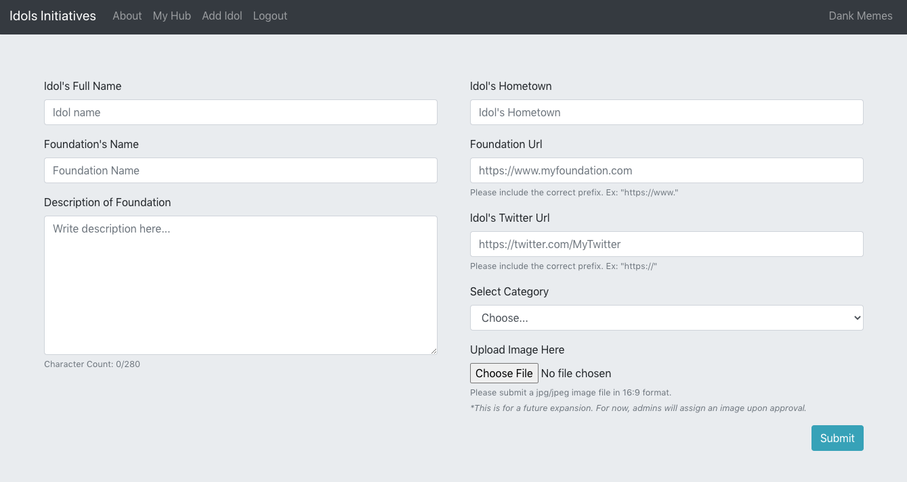
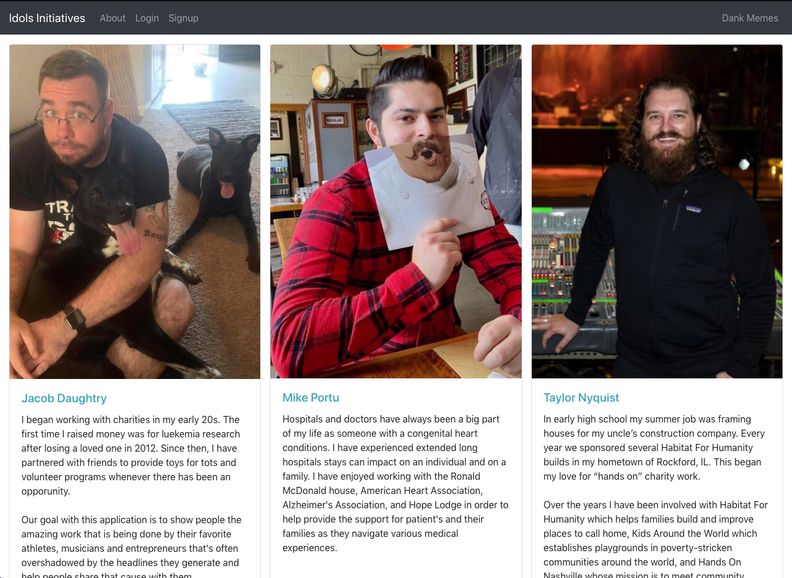
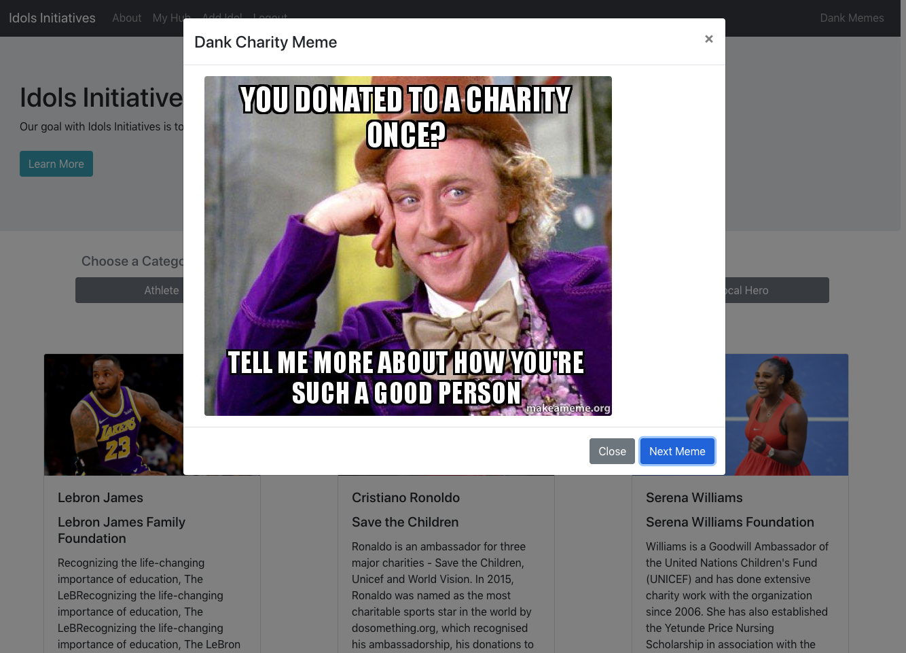

# Idols Initiatives
A React and GraphQL site to browse celebrities' foundations in order to raise awareness and donations for charitible causes.


           

## Description
* This is a charity hub to find out what your favorite athlete, musician, entrepreneur or local hero's foundation is.  Here you will find information about each celebrity's foundation as well as links to the foundation's homepage and the celebrity's twitter so you can get involved and contribute your time or money.  Users are also able to create a username and login to add different foundations to their hub and follow the work they are doing.

* The backend is a Node.js server hosted on Heroku utilizing a MongoDB Atlas NoSQL via GraphQL and Apollo Server.

* The frontend was built using React, Bootstrap and Apollo Provider.

## Links
* [GitHub Repo Link](https://github.com/taylornyquist/idols-initiatives)
* [Link to Deployed Application](https://radiant-temple-46938.herokuapp.com/)

## Screen Shots






## Table of Contents

* [Usage](#usage)
* [Installation](#installation)
* [Run](#run)
* [Technology](#technology)
* [Questions](#questions)
* [Contribution](#contribution)

## Usage
Visit the Heroku [link](https://radiant-temple-46938.herokuapp.com/) to use the deployed application.  There you can create a login, browse foundations and add/remove foundations from your hub.

To run application locally, go to GitHub to clone the repo to your machine.

## Installation
To install necessary dependencies, run the following command:
```
npm install
```
This should install the following dependencies into package.json:

Root package.json:
```
"dependencies": {
    "if-env": "^1.0.4"
},
"devDependencies": {
    "concurrently": "^5.2.0"
} 
```

Server package.json:
```
"dependencies": {
    "apollo-server-express": "^2.15.0",
    "bcrypt": "^4.0.1",
    "express": "^4.17.1",
    "jsonwebtoken": "^8.5.1",
    "mongoose": "^5.9.10"
},
"devDependencies": {
    "nodemon": "^2.0.3"
}
```

Client package.json:
```
"dependencies": {
    "@apollo/react-hooks": "^3.1.5",
    "@material-ui/core": "^4.11.0",
    "@material-ui/icons": "^4.9.1",
    "@testing-library/jest-dom": "^5.11.5",
    "@testing-library/react": "^11.1.0",
    "@testing-library/user-event": "^12.1.10",
    "apollo-boost": "^0.4.9",
    "bootstrap": "^4.4.1",
    "graphql": "^15.1.0",
    "graphql-tag": "^2.10.3",
    "jwt-decode": "^2.2.0",
    "react": "^17.0.1",
    "react-bootstrap": "1.0.1",
    "react-dom": "^17.0.1",
    "react-redux": "^7.2.2",
    "react-router-dom": "^5.1.2",
    "react-scripts": "4.0.0",
    "redux": "^4.0.5",
    "redux-devtools-extension": "^2.13.8",
    "web-vitals": "^0.2.4",
    "workbox-background-sync": "^5.1.4",
    "workbox-broadcast-update": "^5.1.4",
    "workbox-cacheable-response": "^5.1.4",
    "workbox-core": "^5.1.4",
    "workbox-expiration": "^5.1.4",
    "workbox-google-analytics": "^5.1.4",
    "workbox-navigation-preload": "^5.1.4",
    "workbox-precaching": "^5.1.4",
    "workbox-range-requests": "^5.1.4",
    "workbox-routing": "^5.1.4",
    "workbox-strategies": "^5.1.4",
    "workbox-streams": "^5.1.4"
  },
```

## Run
First, seed the data:
```
npm run seed
```

To run the application as a local host, run:

```
npm start
```

## Technology
This application used the following technology:

* HTML
* CSS
* JavaScript
* Node.js
* Express.js
* MongoDB
* Mongoose JS
* React
* React Router
* React Bootstrap
* React Redux
* Redux DevTools
* GraphQL
* Apollo
* JSON Web Tokens
* bcrypt

## Questions
If you have any questions about the repo, open an issue or contact us directly via GitHub.  You can find more of our work at the GitHub links below.


## Contribution
* [Mike Portu](https://github.com/mlportu)
* [Jacob Daughtry](https://github.com/akutozo)
* [Taylor Nyquist](https://github.com/taylornyquist)
