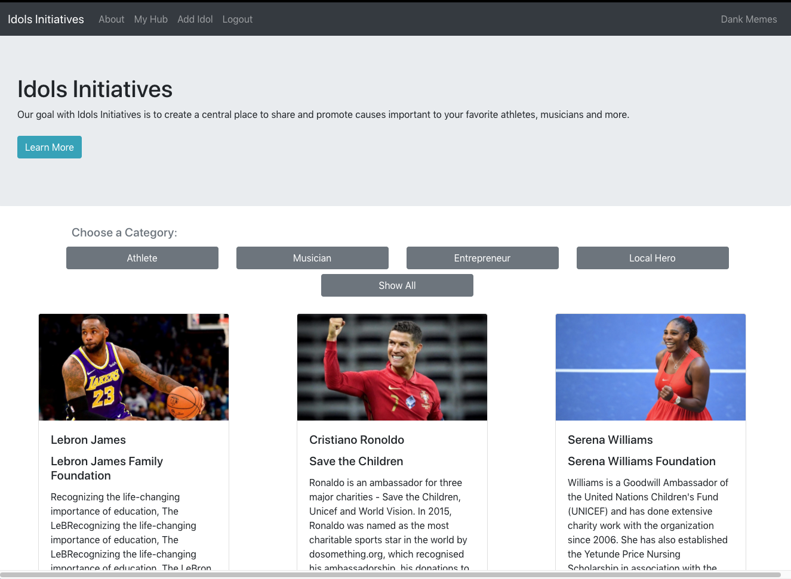
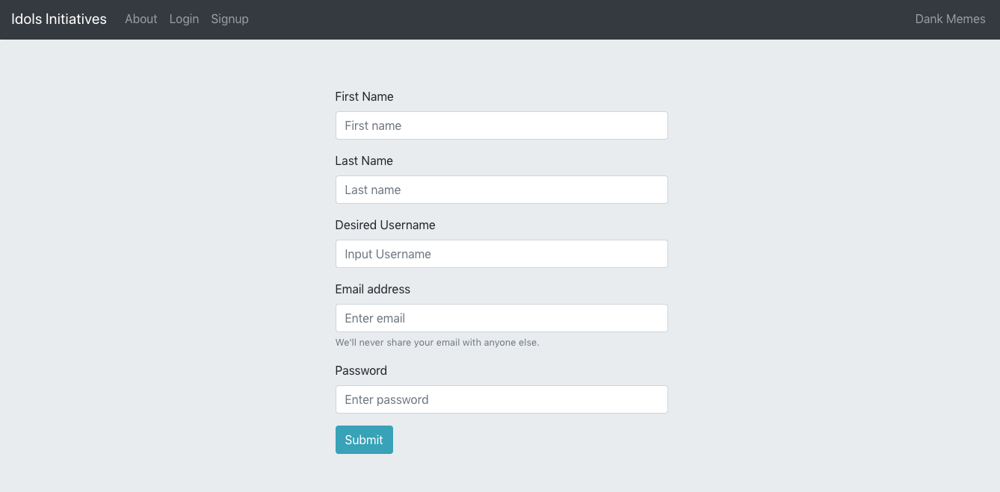
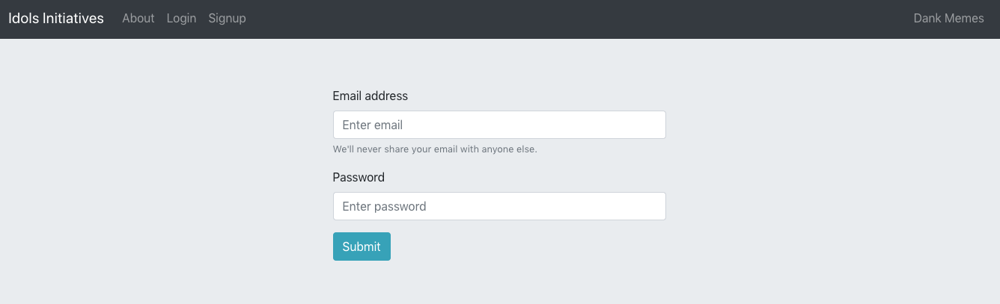
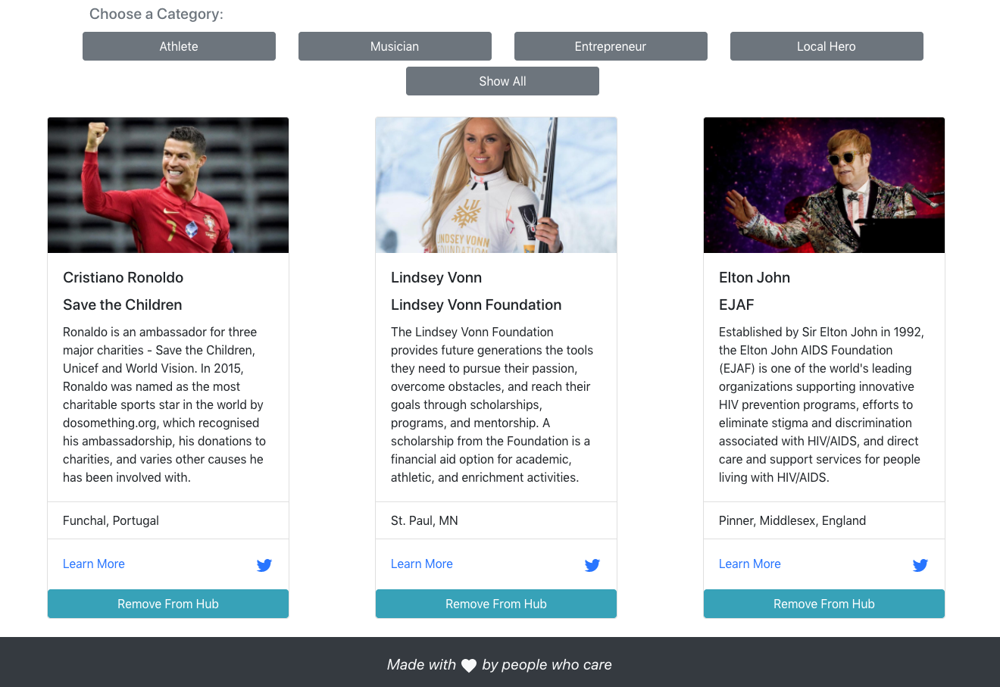

# Idols Initiatives
* A React and GraphQL site to search and save books from Google's book API.

## Description
* This is a book search engine made with React and GraphQL.  It utilizes Google's book API to search for books by subject, title, author, etc.  Users can login to save books to their account.  They can remove the book from their account when they are finished or disinterested.

* The backend is a Node.js server hosted on Heroku utilizing a MongoDB Atlas NoSQL via GraphQL and Apollo Server.

* The frontend was built using React and Apollo Provider.

## Links
* [GitHub Repo Link](https://github.com/taylornyquist/book-search-engine)
* [Link to Deployed Application](https://gentle-plains-60443.herokuapp.com/)

## Screen Shots







## Table of Contents

* [Usage](#usage)
* [Installation](#installation)
* [Run](#run)
* [Technology](#technology)
* [Questions](#questions)
* [Contribution](#contribution)

## Usage
Visit the Heroku [link](https://gentle-plains-60443.herokuapp.com/) to use the deployed application.  There you can create a login, browse books, and add/remove books from your account.

To run application locally, go to GitHub to clone the repo on your machine.

## Installation
To install necessary dependencies, run the following command:
```
npm init
```
```
npm install
```
This should install the following dependencies into package.json:

Root package.json:
```
  "dependencies": {
    "if-env": "^1.0.4"
  },
  "devDependencies": {
    "concurrently": "^5.2.0"
  }
```

Server package.json:
```
 "dependencies": {
    "apollo-server-express": "^2.15.0",
    "bcrypt": "^4.0.1",
    "express": "^4.17.1",
    "jsonwebtoken": "^8.5.1",
    "mongoose": "^5.9.10"
  },
  "devDependencies": {
    "nodemon": "^2.0.3"
  }
```

Client package.json:
```
 "dependencies": {
    "@apollo/react-hooks": "^3.1.5",
    "@testing-library/jest-dom": "^4.2.4",
    "@testing-library/react": "^9.3.2",
    "@testing-library/user-event": "^7.1.2",
    "apollo-boost": "^0.4.9",
    "bootstrap": "^4.4.1",
    "graphql": "^15.1.0",
    "graphql-tag": "^2.10.3",
    "jwt-decode": "^2.2.0",
    "react": "^16.13.1",
    "react-bootstrap": "1.0.1",
    "react-dom": "^16.13.1",
    "react-router-dom": "^5.1.2",
    "react-scripts": "3.4.1"
  },
```

## Run
To run the application as a local host, run:

```
npm start
```

## Technology
This application used the following technology:

* HTML
* CSS
* JavaScript
* Node.js
* Express.js
* MongoDB
* Mongoose JS
* React
* React Router
* React Bootstrap
* GraphQL
* Apollo
* JSON Web Tokens
* bcrypt

## Questions
If you have any questions about the repo, open an issue or contact me directly at tnyquist@gmail.com.  You can find more of my work at [taylornyquist](https://github.com/taylornyquist).


## Contribution
* Taylor Nyquist